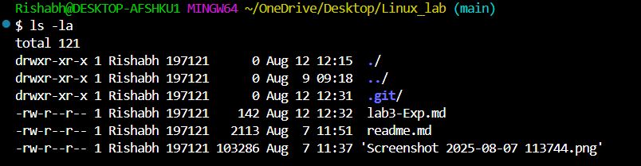

# Basic Linux Commands
```bash 
>> pwd
```

```
Output:
/c/Users/Rishabh/OneDrive/Desktop/Linux_lab

```
```bash
>> ls
```
```
Output of ls:
 lab3-Exp.md   readme.md  'Screenshot 2025-08-07 113744.png'
 ```

 ## ls flags

 # ls command 

 ```
 The ls command is linux allows to to view all the files and folder in current working directory. Flag -a list down all file and folder including the one which are hidden
 ```
 ```bash
 >> ls-la
 ```

 ## 👆 Output of ls-la

 ```
 total 121
drwxr-xr-x 1 Rishabh 197121      0 Aug 12 12:15  ./
drwxr-xr-x 1 Rishabh 197121      0 Aug  9 09:18  ../
drwxr-xr-x 1 Rishabh 197121      0 Aug 12 12:31  .git/
-rw-r--r-- 1 Rishabh 197121    142 Aug 12 12:32  lab3-Exp.md
-rw-r--r-- 1 Rishabh 197121   2113 Aug  7 11:51  readme.md
-rw-r--r-- 1 Rishabh 197121 103286 Aug  7 11:37 'Screenshot 2025-08-07 113744.png'

```


