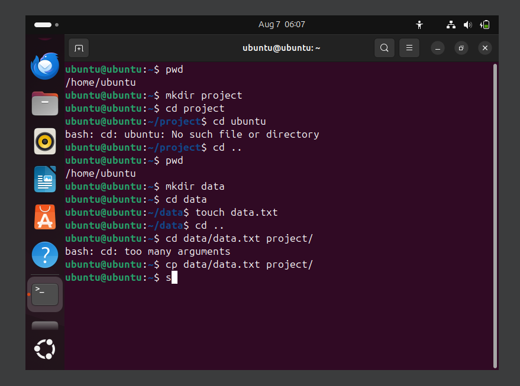

Here's a simple `readme.md` file that explains the basic Linux commands: `rm`, `cp`, `touch`, and `mv` (for moving files). It includes a small example of how to move a file from one location to another.

---

### 📄 `README.md`

````markdown
# Linux Command Basics

This file contains a simple explanation of four common Linux commands:
- `rm` – Remove files or directories
- `cp` – Copy files or directories
- `touch` – Create empty files
- `mv` – Move or rename files and directorieskjnkn

---

## 🗑️ rm - Remove Files or Directories

**Syntax:**
```bash
rm filename
````

**Examples:**

```bash
rm file.txt         # Deletes the file named file.txt
rm -r folder/       # Recursively deletes a folder and its contents
```

---

## 📋 cp - Copy Files or Directories

**Syntax:**

```bash
cp source destination
```

**Examples:**

```bash
cp file1.txt file2.txt        # Copies file1.txt to file2.txt
cp -r dir1/ dir2/             # Recursively copies dir1 into dir2
```

---

## ✨ touch - Create Empty Files

**Syntax:**

```bash
touch filename
```

**Examples:**

```bash
touch myfile.txt              # Creates an empty file named myfile.txt
```

---

## 🚚 mv - Move or Rename Files and Directories

**Syntax:**

```bash
mv source destination
```

**Examples:**

```bash
mv file.txt /home/user/docs/  # Moves file.txt to /home/user/docs/
mv oldname.txt newname.txt    # Renames the file
```

---

## 🧪 Example: Moving a File

### Step-by-step:

```bash
touch example.txt                 # Step 1: Create a file
mkdir destination                 # Step 2: Create a folder named 'destination'
mv example.txt destination/       # Step 3: Move 'example.txt' into 'destination' folder
```

After this, `example.txt` will be inside the `destination/` directory.

---


```

---

Would you like me to save and export this as a `.md` file for download?
```


